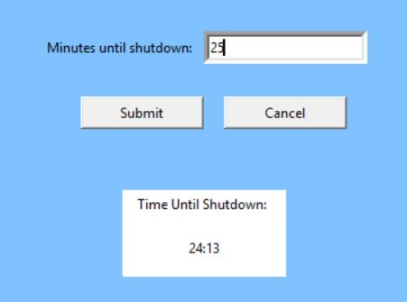

# Sleep-Timer-for-Windows
A simple sleep timer GUI for Windows

It's just a sleep timer for Windows with a simple GUI.
To run this program you must have Python installed. This was made in Python 3 but it probably would 
work in python 2 with some minor changes here and there. You could also probably make an executable
for this using PyInstaller, I didn't bother personally because this was just made to learn a bit about
Python GUI using tkinter. There should be no other dependencies except for Windows of course.

